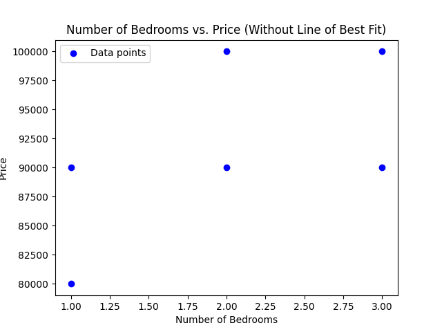

<h1 style="text-align:center; text-decoration:underline;">Lesson 1: The Line of Best Fit</h1>

So we've got some data. House price data, to be exact. There are only 6 data points and they are all made up. This is to keep things easy at the beginning.

Below, we have both the data in a table, and plotted;

| No. of Bedrooms | Price   |
| :-------------: | :------ |
|        1        | 80,000  |
|        1        | 90,000  |
|        2        | 100,000 |
|        2        | 90,000  |
|        3        | 100,000 |
|        3        | 90,000  |

Now, this is totally smashing, but what use is this?

Well, with a little magic, we can use out data to plot a line that fits with our data, and thus make predictions on the price of other houses!

We are going to go through this by hand (hence the tiny dataset) so we can see this works. Then, we'll fit this in with the wider concept of machine learning.

<h2 style="text-align:center; text-decoration:underline;">What is the Line of Best Fit</h2>
